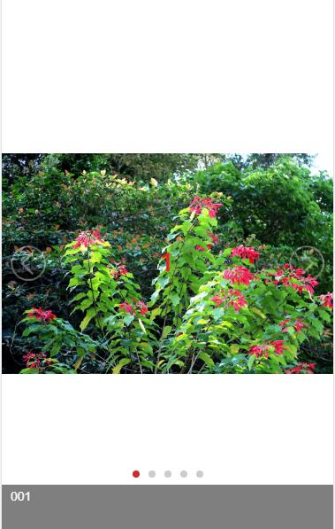

## Swiper3.x使用笔记

## 介绍
> 当前Swiper最新版本为4.x版本，当前是3.x
的使用记录

> [4.x与3.x,API变化说明](http://www.swiper.com.cn/api/index.html)

## 文档参考
+ [Swiper中文网](http://www.swiper.com.cn/usage/index.html)

## Demo功能说明

> ### 案例1[D0001]
+ 基本使用
+ 无缝轮播
+ 内容图片为背景图片
+ 带标题内容的切换
+ 自定义左右按钮样式
#### 效果
PC: 
移动: 
  

